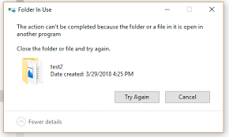

# 🧟‍♂️ ZombieKill: The Unstuck Forced File Unlocker



## 🛑 The Error You Are Getting:
If you are reading this, you are probably incredibly frustrated by this exact Windows error message:
> **"Folder In Use"**
> **"The action can't be completed because the folder or a file in it is open in another program"**
> **"Close the folder or file and try again."**

You've tried closing all your apps. You've tried restarting Windows Explorer. You might have even restarted your computer, but the ghost program (a "Zombie Process") is still holding your file hostage. Windows refuses to tell you *which* program is causing the issue. 

This repository fixes that instantly.

---

## 🚀 The Solution
**ZombieKill (The Unstuck Utility)** is a lightweight, extremely powerful Windows tool. When you drag and drop your locked file onto this tool, it forcefully hunts down the invisible program holding your file, terminates it at the kernel level, and deletes the stubborn file for you.

---

## 👶 Absolute Beginner's Guide (No Coding Knowledge Required!)

If you are not a programmer and just want to delete your file, follow these exact steps:

### Step 1: Download the Tool
1. Go to the **[Releases](../../releases)** page on the right side of this GitHub repository.
2. Download the `unstuck_utility.exe` file to your Desktop.

### Step 2: Unlock and Delete Your File
1. Find the file or folder that is giving you the "Folder In Use" error.
2. Click and hold the locked file with your mouse.
3. Drag it directly on top of the `unstuck_utility.exe` icon and let go.
4. A black window will quickly flash, telling you it found the zombie program.
5. **Boom.** The program is killed, and your file is deleted automatically. 

*(Note: Windows might ask for Administrator Permissions when you run it. Click "Yes" because the tool needs deep system access to break the lock).*

---

## 👨‍💻 Advanced Guide (For Developers & Tech Savvy Users)

### SEO & How it Works Under the Hood
Standard Windows APIs cannot break file locks without knowing the Process ID. This utility uses undocumented Windows NT Internal Kernel APIs (`NtQuerySystemInformation` and `NtQueryObject`). It scans the `SystemExtendedHandleInformation` array, traversing every single handle in the OS. Once it matches the native file path of your locked file, it extracts the rogue PID, uses `TerminateProcess` to execute the zombie, and runs `DeleteFileW`.

Keywords: *The action can't be completed because the folder or a file in it is open in another program, Folder In Use error Windows, File In Use error fix, How to delete a file that is open in another program, Force delete file Windows, Close the folder or file and try again fix, Zombie process file lock breaker.*

### Step-by-Step Compilation Guide
If you want to build this tool from the source code yourself:

**Prerequisites:**
1. Download and install **[Visual Studio Community](https://visualstudio.microsoft.com/vs/community/)**. During installation, make sure to check the box for **"Desktop development with C++"**.
2. Download and install **[CMake](https://cmake.org/download/)**. (Make sure to select "Add CMake to the system PATH" during installation).

**Building the Project:**
1. Click the green **"<> Code"** button at the top of this GitHub page and select **"Download ZIP"**. Extract it to a folder.
2. Open your start menu, search for **"x64 Native Tools Command Prompt for VS"** and open it.
3. Type `cd` followed by a space, and paste the path to where you extracted the folder. Press Enter.
4. Run these exact commands, one by one:
   ```cmd
   mkdir build
   cd build
   cmake ..
   cmake --build . --config Release
   ```
5. You will now find `unstuck_utility.exe` inside the `build/Release` folder!

### Safe Testing Method
Want to test if it works without deleting something important?
1. Create a dummy text file named `test.txt` on your Desktop.
2. Open a terminal and run `python -c "f = open('test.txt', 'w'); input('Press Enter to close...')"` (leave it running).
3. Try to delete `test.txt` normally (you will get the "File In Use" error).
4. Drag `test.txt` onto `unstuck_utility.exe`. Watch the python process get terminated and the file disappear!

---
*Created by Dev Jhawar | KIIT University*
